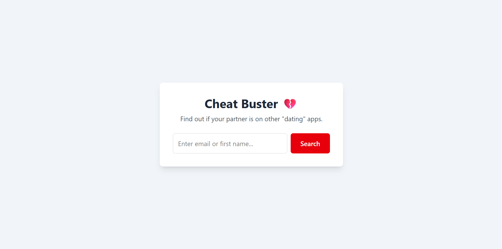
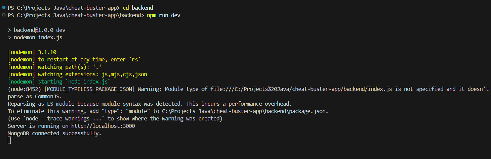
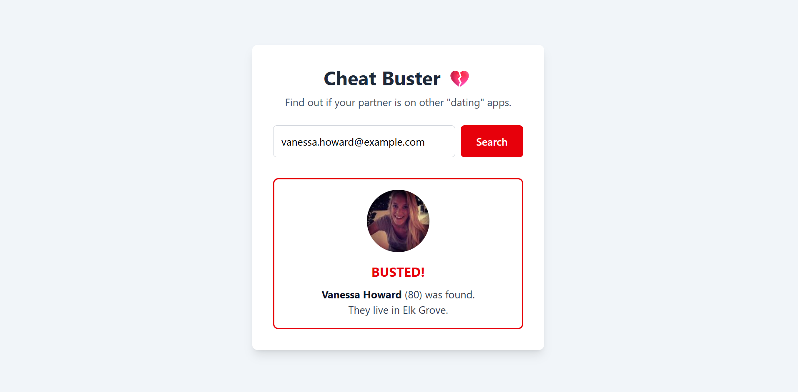
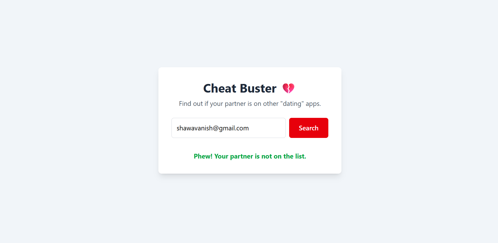
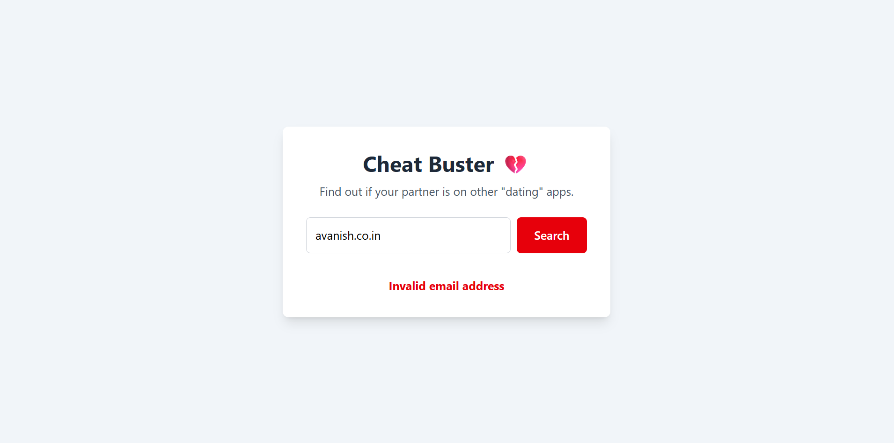

# Cheat Buster 💔 - A Full-Stack React & Node.js Application

[](https://opensource.org/licenses/MIT)
[](https://react.dev/)
[](https://nodejs.org/)
[](https://tailwindcss.com/)

An application to check if a partner might be on a... less than faithful... list of users. This project is a complete full-stack application built from the ground up, featuring a modern, fast, and responsive frontend powered by **React** and **Vite**, and a robust, secure backend powered by **Node.js**, **Express**, and **MongoDB**.

### ✨ INTERFACE

*(This is Interface of the webpage)*



---

## Table of Contents

- [About The Project](#about-the-project)
- [Key Features](#key-features)
- [Technology Stack](#technology-stack)
- [Project Structure](#project-structure)
- [Getting Started](#getting-started)
  - [Prerequisites](#prerequisites)
  - [Backend Setup](#backend-setup)
  - [Frontend Setup](#frontend-setup)
- [Usage & Screenshots](#usage--screenshots)
- [License](#license)

---

## About The Project

The "Cheat Buster" application was developed as a learning project to master the fundamentals of modern full-stack web development. It began as a simple vanilla JavaScript application and was completely rebuilt using a professional-grade architecture.

The core idea is to provide a simple interface for a user to query a database. This project demonstrates key skills in API design, database management, frontend state management, and the integration of separate services into a single, cohesive application.

---

## Key Features

- ✅ **Full-Stack Architecture:** Clean separation between the backend API and the frontend client.
- ✅ **RESTful API:** A well-defined backend API serves user data from a MongoDB database.
- ✅ **Dynamic Frontend:** A responsive and interactive user interface built with React.
- ✅ **Database Seeding:** A script to automatically populate the database with realistic test data from a third-party API (`randomuser.me`).
- ✅ **Input Validation:** Robust server-side validation using **Zod** to ensure data integrity and security.
- ✅ **Clear User Feedback:** The UI provides distinct, styled messages for all possible outcomes:
    - User Found ("Busted!")
    - User Not Found ("Safe")
    - Invalid Input
    - Server Connection Errors
- ✅ **Loading State:** A smooth loading indicator prevents multiple submissions and improves user experience.

---

## Technology Stack

This project uses a modern, industry-standard tech stack.

| Area | Technologies |
| :--- | :--- |
| **Frontend** |    **Axios** |
| **Backend** |   **Zod**, **Dotenv**, **CORS** |
| **Database** |  **Mongoose**, **MongoDB Atlas** |

---

## Project Structure

A monorepo structure is used to keep the frontend and backend code separate but within the same parent repository for easy management.

```

cheat-buster-app/
├── backend/
│   ├── controllers/
│   │   └── user.controller.js
│   ├── models/
│   │   └── user.model.js
│   ├── routes/
│   │   └── user.routes.js
│   ├── .env
│   ├── index.js
│   ├── package.json
│   └── seed.js
│
├── frontend/
│   ├── public/
│   ├── src/
│   │   ├── api/
│   │   │   └── userAPI.js
│   │   ├── components/
│   │   │   ├── Results.jsx
│   │   │   └── SearchForm.jsx
│   │   ├── App.jsx
│   │   ├── index.css
│   │   └── main.jsx
│   ├── package.json
│   └── vite.config.js
│
└── README.md

```

---

## Getting Started

To get a local copy up and running, follow these simple steps. This requires a two-terminal workflow.

### Prerequisites

- **Node.js** and **npm** (or yarn/pnpm) installed on your machine.
- A **MongoDB Atlas** account and a connection string (URI).

### Backend Setup (Terminal 1)

1.  **Clone the repo** (or navigate to your project folder).
2.  **Navigate to the backend folder:**
    ```sh
    cd cheat-buster-app/backend
    ```
3.  **Install NPM packages:**
    ```sh
    npm install
    ```
4.  **Create a `.env` file** in the `backend` folder and add your MongoDB connection string:
    ```env
    MONGO_URI="your_mongodb_connection_string_here"
    PORT=3000
    ```
5.  **Seed the database** (This is a one-time step to populate the database):
    ```sh
    node seed.js
    ```
   

6.  **Start the backend server:**
    ```sh
    npm run dev
    ```
    Your backend API will be running on `http://localhost:3000`. Keep this terminal running.
    


### Frontend Setup (Terminal 2)

1.  **Open a new terminal**.
2.  **Navigate to the frontend folder:**
    ```sh
    cd cheat-buster-app/frontend
    ```
3.  **Install NPM packages:**
    ```sh
    npm install
    ```
4.  **Start the frontend development server:**
    ```sh
    npm run dev
    ```
    Your React app will open in your browser, likely at `http://localhost:5173`.

---

## Usage & Screenshots

Once both servers are running, you can test the application's functionality.

#### **User Found ("Busted!")**
Enter an email that exists in the database.



#### **User Not Found ("Safe")**
Enter an email that does not exist.



#### **Invalid Input**
Enter an invalid email format to see the Zod validation in action.



#### **Loading State**
The UI provides clear feedback while the search is in progress.


---

## License

Distributed under the MIT License. See `LICENSE` for more information.
